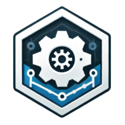

# ClusterOps

**ClusterOps** is a Kubernetes installer _and_ operator designed to streamline the initial configuration
and ongoing maintenance of kubernetes clusters. The focus of this project is primarily on personal
or local installations. However, the goal is to expand its use to encompass all installations of
Kubernetes for local development purposes.  
It simplifies cluster management by automating tasks and providing just one user-friendly YAML-based
configuration [config.yml](config.yml).

## Overview
  * **Simplified Configuration:** Define your desired cluster state in a simple YAML file, 
    and ClusterOps will handle the rest.
  * **Automated Setup:**  Automates initial cluster configuration, including network settings,
    storage provisioning, special requirements (for example GPUs) and essential components
    installation.
  * **Ongoing Maintenance:**  Performs routine maintenance tasks such as upgrades, security 
    updates, and resource monitoring.
  * **Extensibility:** Easily extend functionality with custom plugins and configurations.
  * **Self-Healing:** Detects and recovers from common cluster issues, ensuring stability, idempotence
    and reliability. Same operation can be performed multiple times without changing the result.
  * **Discreet:** It works only on what it knows, if you are manually configuring parts of your
    kubernetes and this configuration does not interfere with it you can happily continue to work
    on several parts and use this tool only for what is needed.

## Features
- **distribution and engine independence**. Install your favorite kubernetes engine with your package
manager, execute **_one_** script and you'll have a complete working environment at your disposal.  
- **Basic config** approach. One single [config.yml](config.yml) file with configuration requirements
(add/remove features): human readable, plain and simple. All fancy configs managed automatically
(ingress, balancers, services, proxy, ...).
- **Local Builtin ContainerHub**.  The default installation provides a fully configured ContainerHub
available locally along with the kubernetes installation. This configuration allows the user to
build, upload and deploy custom container images as they were provided from external sources.
Internet public sources are still available but local development can be kept in this localhost
server. Builtin ClusterOps operator will be fetched from this ContainerHub registry too.
- **Kubernetes official dashboard** installed as a plugin, others planned too (k9s for example).
- **Kubevirt** plugin installed and properly configured.  Unleash the power of classic virtualization
(KVM+QEMU) on top of Kubernetes and manage your entire system from there, _libvirtd_ and _virsh_
libs are required.
- _**One operator** to rule them all_. The installation script configures your machine automatically
during installation and adds **one** kubernetes operator to manage your local cluster. From there the
operator takes care of the cluster on your behalf.
- Clean installation and removal. Just test it, when you are done just use the same program to
uninstall everything without leaving configs (or pods) behind.

## Planned features _(Wishlist / TODOs)_
- **Containerized Data Importer (CDI)**. Persistent storage management add-on for Kubernetes to
provide a declarative way of building and importing Virtual Machine Disks on PVCs for 
_**Kubevirt** VMs_.
- **Source2Image** utility. Transform your favorite program (python, go, bash, ...) in a container
in a matter of minutes, kubectl apply and create it as a Pod or a Deployment quickly.
- Kubevirt VMs startup management. Since your personal cluster might not be up and running all the
time this feature will provide basic startup, shutdown, order list commands; it resembles other
VM bare metal configuration suites from the past.
- Lightweight k9s console automatically installed as a plugin from the configuration file
- Add other distributions: suse, debian, rocky/rhel, gentoo, MacOS
- Add other kubernetes engines: minicube, KIND, vanilla k8s, CRC
- Monitoring and observation features, alerting with IM notifications (telegram, signal)
- Remote storage, LAN network volumes, S3 buckets, object storage (CEPH, Longhorn)
- Automatic configuration and support for: Nvidia CUDA, Vulkan drivers. Containers downloaded
from Nvidia ContainerHub and relative websites should be used directly without additional
configuration.
- **Cloud Controller Manager (CCM)**. A Kubernetes control plane component that embeds cloud
specific control logic. This component with a specific automation tool easily allows to migrate
local working environment to external _(private | hybrid | public)_ clouds.

## Getting Started: Installation/Removal
- Prerequisite: `kubectl` CLI utility installed to interact with your cluster.
- See [README](doc/README.md) for details on installation or removal, basically this is valid for
each kubernetes engine and consists of two parts:
  - Install your favorite kubernetes engine with the system defined package manager.
  - Edit your `config.yml` file to suit your needs (addons plugins, cluster info, virtuazionation).
  - Oneliner instruction to configure it all, from this command an operator will be installed in the
  cluster and will automatically manage everything for you. More or less something like: 
  _`./clusterctl --os=YourDistroName install`_  
  See [README](doc/README.md) for **all** installation/uninstallation details.

## ClusterConfig Options
The `ClusterConfig` CRD allows you to define various aspects of your cluster configuration.
<!-- some options:
  * **network:** Configure the network plugin (e.g., `calico`, `flannel`).
  * **storage:**  Specify the storage provider (e.g., `longhorn`, `openebs`).
  * **addons:**  A list of addons to install (e.g., `dashboard`, `metrics-server`, `ingress-nginx`).
  * **security:**  Define security settings (e.g., enable pod security policies).
  * **monitoring:**  Configure monitoring tools (e.g., Prometheus, Grafana).
-->

## Contributing
Contributions are welcome\!  
Create a [new issue](https://github.com/andreabenini/podmaster/issues/new/choose),
fork the project or ping the author for further requests.

## License
This project is licensed under the _Affero GPLv3 License_, see the
[LICENSE](./LICENSE) file for details.
