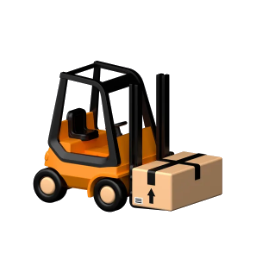

# Forklift - Text based utility for dealing with containers
### What is this for
This is a simple and handy text based GUI utility for dealing with boring
and repetitive tasks while managing containers.  
If you usually manage them in your daily activities you'll surely deal
a lot with the CLI and execute repetitive commands for: 
building images, creating containers, running, killing and stopping
them all the time.  

It doesn't really matter if you are a Developer, a DevOps or a SRE;
most of your time might be spent on the CLI for deleting/respawning/starting
new instances for your favorite product.  
You can surely do it from a GUI or editor (vscode, eclipse, ...)
but it might be messy if you're managing them remotely through SSH and all
you have at your disposal is just your trusty text-only shell connection.  

That's the reason for this simple, quick, text-only utility,
no matter if containers are running on a remote machine, locally or if
you prefer a specific Window Manager.
I expressly don't want to rely on X11/Wayland, infinite dependencies 
and it has to be text-only and usable in a remote shell. This utility is a
pure python built, no extra deps at all.  
It is not a fully fledged solution but rather a small and quick tool for
running boring tasks, you'll still use docker/podman of your choice but
you don't want to be annoyed by usual and repetitive commands
    (`docker ps -a; docker kill <ID>; docker start <ID> <params, ...>`).
That's what this utility is about.


#### Rolling demo overview
https://github.com/andreabenini/podmaster/assets/9632086/198ac4c7-416a-4217-89c6-4eea30e46561


## Features 
- Basic container images management: create (manually/script), rename, delete
- Container management: create, run, attach, stop, kill, rename, log
- Running locally or on a remote SSH connection, text only, no GUI required
- Pure python based GUI utility with just a few keys: cursor arrows, enter, escape
- **NOT** related to Kubernetes, orchestrators or pods, just _"simple"_ containers.  
    Targeted to personal workstations and workflows, no matter if local or on a
    remote ssh shell
- Everything is builtin and self contained in the project, no deps, just pure python3
- _.yaml_ based user configuration (without pyyaml dep !)
- Container engine independent, tested on: **_docker, podman_**. LXD might be
    the next if someone requires it
- Build images and container from within the utility, ContainerCommander like style


## Usage:
```sh
# program help
~$ forklift --help
usage: forklift [-h] [-p PATH]

Forklift: friendly utility for dealing with containers

options:
  -h, --help            show this help message and exit
  -p PATH, --path PATH  System and user configuration files path (default: /where/this/utility/is/stored)

# As simple as:
~$ forklift
# Or add '--path' argument to specify where yaml config files are stored
#     default is set on program current location (see --help for details)
~$ forklift --path $HOME/container_configs
```
- Arrows keys to navigate
- \<enter> to confirm, \<esc> to abort commands


## Installation and configuration

- Requirements: _'python3'_ is the only requirement, nothing else. There's **_no need_** for a VirtualEnv
- Installation methods:
    1. Just download `forklift.app` file and use it as a standalone application. Python3 is the only thing
    you needs in your system, nothing else. This compact executable contains **everything**,
    add optional .yaml files if you need them _(see below)_
    2. From source [the official repository](https://github.com/andreabenini/podmaster/tree/main/forklift),
    this site. Clone the repo or download sources from there. `forklift|forklift.py` is the classic python3
    application with full sources provided in its modules, `forklift.app` is a onefile, standalone and self
    contained app, it's still based on python3 but it's easy to move it elsewhere.
    3. ~~from **_pip_**~~:  
        ~~`pip install forklift/podmaster`~~  
        - **_(WORK IN PROGRESS, please stand by. I'm dealing the name with PyPi package maintainers)_**
        - I've just received the `forklift` name from PyPi repository
        (https://pypi.org/)  
        - I'm now building a suitable self contained executable that can be delivered and installed with `pip`
- **_[Optional]_** Set `$EDITOR` environment variable in your favorite shell. If you have a working
    environment with *$EDITOR* set in place you can directly edit **`.yaml`** configuration files
    from the utility
    ```sh
    # file: $HOME/$USER/.bashrc
    # Default editor
    export EDITOR=/usr/bin/vim
    ```
- **_[Optional]_** Create your `containers.yaml` and `images.yaml` files to have working templates
    while using the utility. You can create and edit them externally from the shell or 
    automatically while using the program. These two samples are provided as a reference:
    `containers.yaml.sample`, `images.yaml.sample`. Future upgrades will never replace your working
    configuration.
    ```sh
    # optional, up to you, feel free to create or add info to yours
    cp containers.yaml.sample containers.yaml
    cp images.yaml.sample     images.yaml
    ```
- Start the program and you're ready to go, feel free to store it wherever you prefer
    ```sh
    ~$ forklift
    # ~$ forklift.app       # If you're using the minified version
    ```


## Deploy and execute on remote machines
Copying the application elsewhere or executing it in a remote machine (or cluster) is pretty
straightforward.  
Small utilities with a small footprint are always preferred to a bigger boilerplate with redundant
functions that can be reproduced with readymade tools.  
There's no need for a little utility like this to implement remote shell execution tasks easily attachable
with RSA keys and your trusty SSH connection, for the same reason keeping its footprint as small as
possible is always preferred to adding extra features for a tool that it's conceived mostly for personal
usage.  
However an answer to this recurring question might be conceived and fulfilled with a small script, from
now supplied as an official part of this repository, script is called **[remote.execute.sh](remote.execute.sh)** and it basically
lets you control and execute forklift on a remote machine. I still prefer a terminal multiplexer utility
(**tmux** is my personal favorite, **screen** and others works well too) and keep this program on remote,
if you need to give it a shot elsewhere this might still be a nice idea for you, it basically:  
- copies (scp) `forklift.app` (full self contained) on the remote host
- execute it directly there (through ssh)
- delete it from remote once done

Feel free to edit that simple **[remote.execute.sh](remote.execute.sh)** and adapt it to your needs. Having a correct 
`.ssh/authorized_keys` file in place on remote hosts helps you a lot if you want to avoid authentication
requests each single time. Feel free to share your experiences or submit MRs for it.


## Contributing
Feel free to raise issues, pull requests and suggest improvements. It's a ready
made utility but it can be enhanced and new features might be added with your
contribution.
